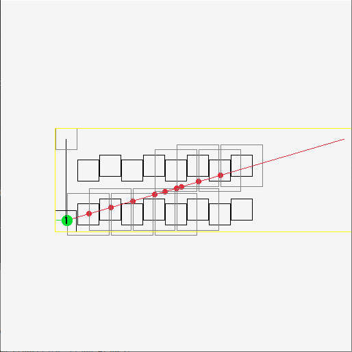
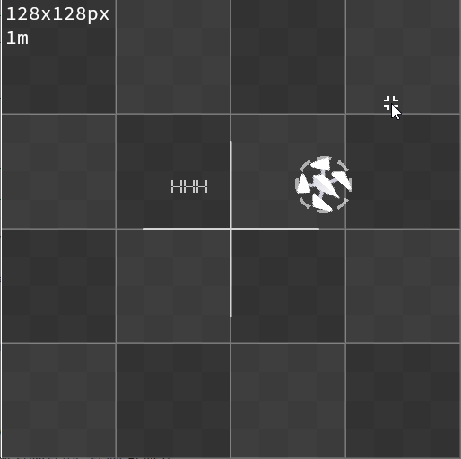
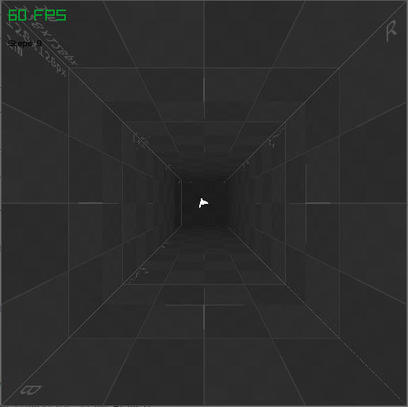
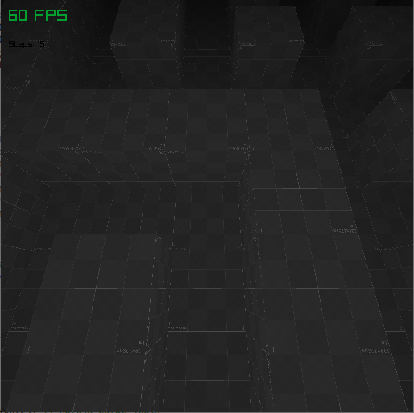
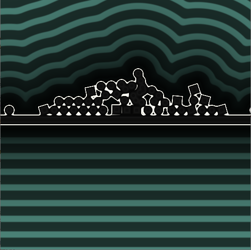
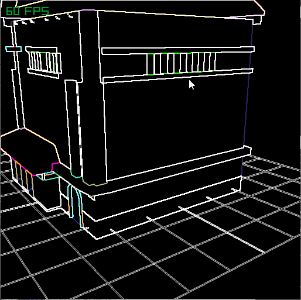
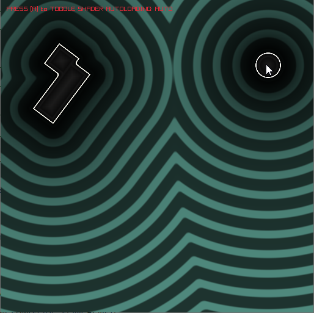

Prev version on [gitlab](https://gitlab.com/tynrare/dust-220624).

# Build

- Had to add `include_directories(extern/simde)` line into `external/box2c/CMakeLists.txt` to build it properly
- Didn't test build .sh scripts for a while

# pic

